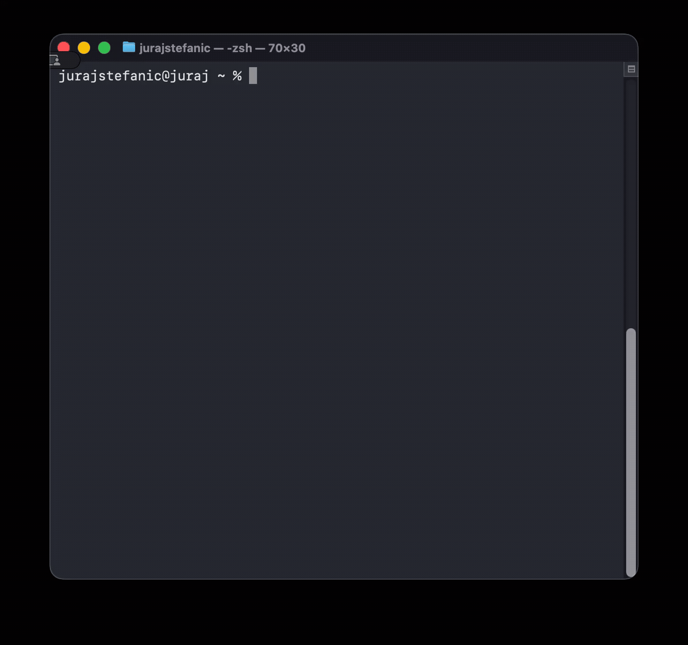

# todo-md

Local, simple, and fast command-line todo application with export to Markdown.



## Installation

### Build from Source

1. Clone the repository:

```bash
git clone https://github.com/stefanicjuraj/todo-md
```

2. Build the binary:

```bash
make build
```

3. Install (choose one):

   **System-wide installation** (requires sudo):

   ```bash
   make install
   ```

   **User installation** (no sudo required):

   ```bash
   make install-user
   ```

   Make sure `~/go/bin` is in your PATH.

### Manual Installation

```bash
go build -o bin/todo .
sudo cp bin/todo /usr/local/bin/
```
